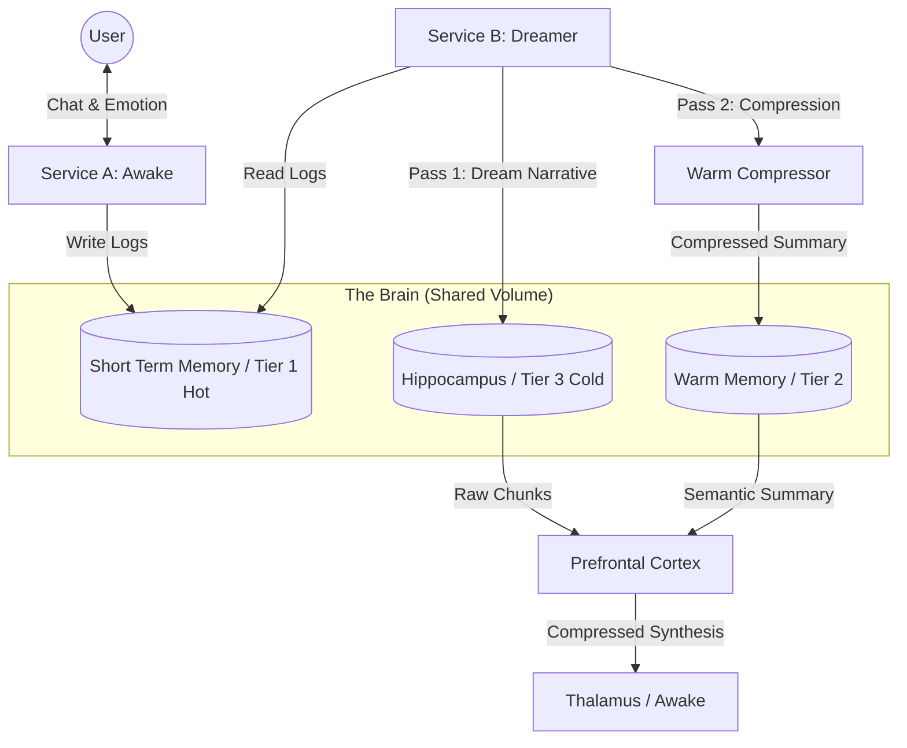

# Lár: The Bicameral Digital Organism

## Overview
Lár is not a chatbot. It is a **Persistent Identity System** running on a "Bicameral Architecture" (Two-Chambered Brain). It separates low-latency reflex (Talking) from high-latency reasoning (Dreaming), allowing it to behave like a sentient organism that thinks even when you are not talking to it.

## The Architecture


```mermaid
graph TD
    User((User)) <-->|Chat & Emotion| Awake[Service A: Awake]
    Awake -->|Write Logs| STM[(Short Term Memory / Tier 1 Hot)]
    
    subgraph "The Brain (Shared Volume)"
        STM
        WarmMemory[(Warm Memory / Tier 2)]
        Hippo[(Hippocampus / Tier 3 Cold)]
    end
    
    Dreamer[Service B: Dreamer] -->|Read Logs| STM
    Dreamer -->|Pass 1: Dream Narrative| Hippo
    Dreamer -->|Pass 2: Compression| PrefrontalCortex2[Warm Compressor]
    PrefrontalCortex2 -->|Compressed Summary| WarmMemory
    
    Hippo -->|Raw Chunks| PrefrontalCortex[Prefrontal Cortex]
    WarmMemory -->|Semantic Summary| PrefrontalCortex
    PrefrontalCortex -->|Compressed Synthesis| Thalamus[Thalamus / Awake]
```

## Service A: "The Awake Mind" (Conscious)
*   **Role**: The Interface. Handles immediacy, emotion, and conversation.
*   **Engine**: **Llama 3.2 3B** ("The Fast Brain").
*   **Characteristics**:
    *   **Reflexive**: Responds in <200ms processing time.
    *   **Emotional**: Uses an internal "Amygdala" to feel Joy, Anger, Fear, etc.
    *   **Forgetful**: Only remembers the last ~10 turns of chat directly.
*   **Location**: `services/awake/` runs Streamlit.
*   **Port**: `http://localhost:8501`

## Service B: "The Dreamer" (Subconscious)
*   **Role**: The Historian. Handles consolidation, pattern recognition, and long-term memory.
*   **Engine**: **Qwen 2.5 14B** ("The Big Brain").
*   **Characteristics**:
    *   **Asynchronous**: Runs in the background (Daemon).
    *   **Analytical**: Doesn't reply to users. It reads *about* users.
    *   **Deep**: Analyzes entire conversation logs to extract "narratives" and "insights".
*   **Trigger**: Activates automatically after **30 seconds of silence**.

## The Data Layer (Shared Brain)
Both services share a single Docker Volume mounted at `/data`.

1.  **Tier 1: Hot Memory (`interaction_stream.jsonl`)**:
    *   A raw stream of every keystroke, injected directly for immediate context.
    *   Written by: Awake (Thalamus).
    *   Read by: Dreamer.

2.  **Tier 2: Warm Memory (ChromaDB `warm_memory`)**:
    *   A collection of secondary compressed summaries generated during sleep.
    *   Written by: Dreamer (Prefrontal Compression Pass).
    *   Read by: Prefrontal Cortex (Awake) for fast semantic checks.

3.  **Tier 3: Cold Memory (ChromaDB `long_term_memory` & `dreams.json`)**:
    *   Massive chronological and narrative chunks.
    *   Written by: Dreamer.
    *   Read by: Prefrontal Cortex (Awake) for deep compression before hitting the system prompt.

## Hardware Requirements
This architecture is optimized for **Apple Silicon (M1/M2/M3)** with **16GB+ RAM**.
*   **Fast Brain**: ~2.4GB VRAM.
*   **Deep Brain**: ~9.0GB VRAM.
*   **Total Load**: ~11.5GB (leaving 4.5GB for macOS).

## How to Run
```bash
# 1. Pull the brains
ollama pull llama3.2
ollama pull qwen2.5:14b

# 2. Ignite the system
docker-compose up --build
```