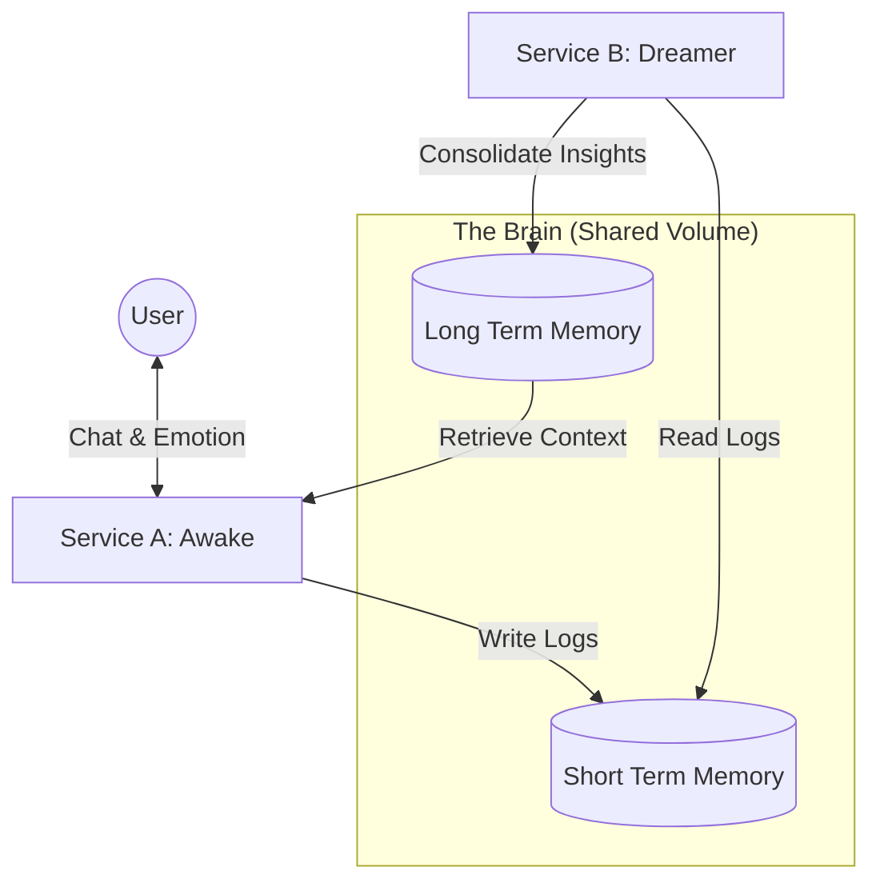

# Lár: The Bicameral Digital Organism

## Overview
Lár is not a chatbot. It is a **Persistent Identity System** running on a "Bicameral Architecture" (Two-Chambered Brain). It separates low-latency reflex (Talking) from high-latency reasoning (Dreaming), allowing it to behave like a sentient organism that thinks even when you are not talking to it.

## The Architecture



## Service A: "The Awake Mind" (Conscious)
*   **Role**: The Interface. Handles immediacy, emotion, and conversation.
*   **Engine**: **Llama 3.2 3B** ("The Fast Brain").
*   **Characteristics**:
    *   **Reflexive**: Responds in <200ms processing time.
    *   **Emotional**: Uses an internal "Amygdala" to feel Joy, Anger, Fear, etc.
    *   **Forgetful**: Only remembers the last ~10 turns of chat directly.
*   **Location**: `services/awake/` runs Streamlit.
*   **Port**: `http://localhost:8501`

## Service B: "The Dreamer" (Subconscious)
*   **Role**: The Historian. Handles consolidation, pattern recognition, and long-term memory.
*   **Engine**: **Qwen 2.5 14B** ("The Big Brain").
*   **Characteristics**:
    *   **Asynchronous**: Runs in the background (Daemon).
    *   **Analytical**: Doesn't reply to users. It reads *about* users.
    *   **Deep**: Analyzes entire conversation logs to extract "narratives" and "insights".
*   **Trigger**: Activates automatically after **30 seconds of silence**.

## The Data Layer (Shared Brain)
Both services share a single Docker Volume mounted at `/data`.

1.  **Short Term Memory (`short_term_memory.jsonl`)**:
    *   A raw stream of every keystroke and emotion.
    *   Written by: Awake.
    *   Read by: Dreamer.

2.  **Long Term Memory (`long_term_insights.json`)**:
    *   A collection of consolidated "dreams" (summaries).
    *   Written by: Dreamer.
    *   Read by: Awake (to answer "Do you remember...?").

## Hardware Requirements
This architecture is optimized for **Apple Silicon (M1/M2/M3)** with **16GB+ RAM**.
*   **Fast Brain**: ~2.4GB VRAM.
*   **Deep Brain**: ~9.0GB VRAM.
*   **Total Load**: ~11.5GB (leaving 4.5GB for macOS).

## How to Run
```bash
# 1. Pull the brains
ollama pull llama3.2
ollama pull qwen2.5:14b

# 2. Ignite the system
docker-compose up --build
```