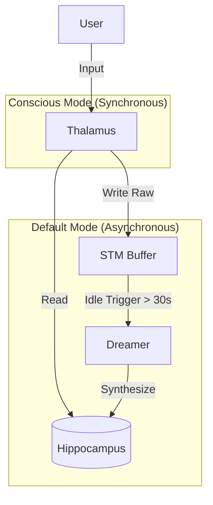

# Technical Report: The Lár Default Mode Network (DMN) Architecture

**Date:** January 7, 2026  
**Author:** Aadithya Vishnu Sajeev  
**License:** Apache 2.0  
**Repository:** [https://github.com/snath-ai/DMN](https://github.com/snath-ai/DMN)

---

## 1. Abstract

This paper describes a novel apparatus and method for **Asynchronous Memory Consolidation in Artificial Agents**, referred to herein as the **Default Mode Network (DMN) Architecture**. Unlike traditional Retrieval-Augmented Generation (RAG) systems which rely on static retrieval of raw logs, the DMN Architecture implements a biological "Sleep/Wake" cycle. This allows an agent to utilize a low-latency "Conscious" model for real-time interaction and a high-latency "Subconscious" model for background memory synthesis, effectively solving the trade-off between inference speed and memory depth.

## 2. Problem Statement

Current Large Language Model (LLM) agents suffer from two primary limitations regarding Long-Term Memory (LTM):

1.  **Context Window Constraints**: Raw conversation logs quickly exceed the token limit of the inference model.
2.  **Compute Latency**: Summarizing or synthesizing these logs into "memories" is computationally expensive. Doing so during the user's "turn" (synchronously) introduces unacceptable latency (e.g., 5-10 seconds of "thinking" time per message).

As a result, most agents remain **amnesic** (stateless) or rely on **naive retrieval** (fetching disjointed keywords without semantic understanding).

## 3. The Novel Method: Bicameral Processing

The novelty of this invention lies in the separation of cognitive load into two asynchronous processes (containers) that share a common state but operate on disjoint triggers.

### 3.1. The "Thalamus" (Fast Process)
*   **Role**: Real-time Input/Output Router.
*   **Model**: Optimized for latency (e.g., Quantized Llama 3.2).
*   **State**: Active only when User Input is detected.
*   **Function**:
    1.  Receives user input.
    2.  Queries the Vector Database (Hippocampus) for *existing* consolidated memories.
    3.  Generates a response.
    4.  Appends the raw interaction to a Short-Term Memory (STM) buffer.
    *   *Crucially, the Thalamus performs NO memory consolidation.*

### 3.2. The "Dreamer" (Slow Process)
*   **Role**: Background Memory Synthesizer.
*   **Model**: Optimized for reasoning capability (e.g., Qwen 2.5-14B or GPT-4).
*   **State**: Active only when the `Idle_Timer` exceeds threshold $T$ (e.g., 30 seconds).
*   **Function**:
    1.  **Wake-on-Idle**: A daemon monitors the system for inactivity.
    2.  **Read**: Fetches the raw STM buffer.
    3.  **Synthesize ("Dreaming")**: Runs a computationally heavy prompt to extract narrative arcs, emotional shifts, and key entities from the raw logs.
    4.  **Consolidate**: Writes the synthesized narrative to the Vector Database (Hippocampus).
    5.  **Clear**: Purges the processed STM buffer.

## 4. Architectural Diagram



## 5. Prior Art Statement

While "Memory Consolidation" is a known concept in neuroscience, the specific **implementation of a Docker-based, multi-model, asynchronous triggers for LLM Agents** constitutes the unique contribution of this work.

Existing systems (e.g., AutoGen, LangChain memory) typically perform summarization:
1.  **Synchronously**: Summarizing the previous $N$ turns *before* generating the next response (high latency).
2.  **Lazily**: Summarizing only when the context window is full (token management, not memory formation).

The DMN Architecture is distinct because it creates a **biological rhythm** (Wake/Sleep) that decouples memory formation from the interaction loop, enabling the use of vastly more powerful models for memory than for speech.

## 6. Implementation

Reference implementation is available at: [https://github.com/snath-ai/DMN](https://github.com/snath-ai/DMN).
The core logic utilizes the **Lár Engine** for deterministic state transitions.

```python
# Pseudo-code of the Novel Trigger Mechanism
def monitor_loop():
    while True:
        last_active = get_last_interaction_time()
        if (now() - last_active) > SLEEP_THRESHOLD:
            if not dreamer.is_awake():
                dreamer.wake_up() # Activates 'Slow' Model
                dreamer.consolidate_memories()
        time.sleep(1)
```

---
*This document serves as public disclosure of the invention for the purpose of establishing Prior Art.*
