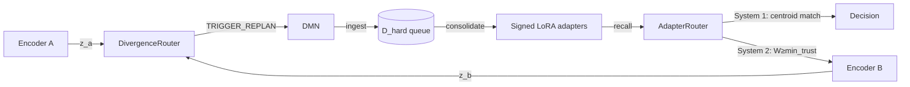

<p align="center">
  
</p>
<p align="center"><em>Lár DMN — The Memory Layer for the Snath AI Cognitive Architecture</em></p>
<p align="center">
  <a href="https://github.com/snath-ai/lar">
    
  </a>
  <a href="https://github.com/snath-ai/DMN/releases/tag/v2.3.1">
    
  </a>
  <a href="https://doi.org/10.5281/zenodo.18175178">
    
  </a>
</p>

# Lár DMN — Continual Learning Without Retraining

Every AI agent forgets everything the moment it stops running. Context windows fill up, old messages get silently truncated, and the agent permanently loses knowledge of past interactions. In world-model systems, high-divergence events are discarded instead of becoming the curriculum for adaptation.

**DMN solves this architecturally.** No weight updates to the base model. No catastrophic forgetting. No retraining loops. Memory and adaptation are treated as infrastructure problems — the same way a database solves persistence without touching application code.

DMN does two things:

1. **Conversation memory** — a `DefaultModeNetwork` with Hippocampus/Dreamer/PFC that solves forgetting for LLM agents across sessions.
2. **Continual learning contracts** — `AbstractDMN` and `AbstractAdapterRouter`, two ABCs that define how any domain accumulates high-divergence events, consolidates them into signed LoRA adapters, and applies them at inference time.

---

## Part of a Larger System

DMN is the memory layer of a three-part cognitive architecture:

| Repository | Role |
| :--- | :--- |
| **[Lár](https://github.com/snath-ai/lar)** | The execution spine — deterministic graph engine, HMAC audit trail, EU AI Act compliance |
| **[Lár DMN](https://github.com/snath-ai/DMN)** ← you are here | The memory layer — conversation memory + continual learning contracts |
| **[Lár-JEPA](https://github.com/snath-ai/Lar-JEPA)** | The world model — 10 ABCs for divergence routing, modal encoding, fault localisation |

The industry is building the Brain (LLMs, JEPAs). We are building the Nervous System.

---

## ABC Contract Layer (v2.3.x)

The primary deliverable of DMN v2.3.x is a pair of ABCs that close the continual learning loop across any domain:

### `AbstractDMN` — the memory contract

```python
from brain.abstract_dmn import AbstractDMN

class AbstractDMN(ABC):
    def ingest(self, event) -> None: ...          # Tier 1: accept event into episodic memory
    def consolidate(self, **kwargs) -> List[dict]: ...  # Tier 2/3: D_hard → signed LoRA adapters
    def recall(self, query, **kwargs) -> Any: ...  # Tier 2: retrieve context for inference
    def stats(self) -> dict: ...                   # queue / memory introspection
```

**Contract rule:** any durable artifact produced by `consolidate` must be HMAC-signed before persisting.

### `AbstractAdapterRouter` — the inference bridge contract

```python
from brain.abstract_adapter_router import AbstractAdapterRouter

class AbstractAdapterRouter(ABC):
    def _load_all(self) -> None: ...              # load + HMAC-verify centroid adapters
    def _nearest(self, delta) -> Optional[Any]: ...  # System 1: trust-invariant match (no temporal gate)
    def resolve(self, z_a, z_b, base_decision,
                conf_a, conf_b, enc_a=None, enc_b=None) -> Tuple[Any, str]: ...
    def available(self) -> List[str]: ...

    def refresh(self) -> None: ...                # concrete — calls _load_all()
    @staticmethod
    def decay_weight(created_at_iso, lam=0.10) -> float: ...  # W = exp(-λ·Δt)
```

### System 1 / System 2 trust asymmetry

`_nearest()` is **trust-invariant** — it fires regardless of adapter age. Failure-class geometry is durable: "ice causes pitot freeze" clusters identically across sensor generations. The temporal gate `W = exp(-λ·Δt)` lives exclusively in `resolve()`, at the `.pt` loading step.

When `W < min_trust`, System 1 still identifies and commits. System 2 correction is withheld. **Identify correctly, correct conservatively.**

Formalised in *Architecture Is All You Need* (Sajeev 2026), §3.4 Remark (Temporal Decay and Synaptic Depression).

### The complete inference contract

Together with `AbstractModalEncoder` and `AbstractDivergenceRouter` from Lár-JEPA, the full loop is now formally contracted:

```
AbstractModalEncoder      →  encode z_a, z_b
AbstractDivergenceRouter  →  V1–V6 routing decision
AbstractDMN               →  ingest → consolidate → recall
AbstractAdapterRouter     →  resolve → (decision, audit_note)
```

Any new domain implements four classes and the OS-level promise holds by construction — swap encoders and the adapter system wires up automatically.

---

## Domain Extensions

All six DMN implementations satisfy `AbstractDMN`. All four domain adapter routers satisfy `AbstractAdapterRouter`:

| Project | DMN class | AdapterRouter class | Domain |
|---|---|---|---|
| **DMN** (this repo) | `DefaultModeNetwork` | — | LLM conversation memory |
| **[Snath Robotics](https://github.com/snath-ai/snath-robotics)** | `RoboticsDMN` | `RoboticsAdapterRouter` | Dual-stream sensor fusion (vision + proprioception) |
| **[Snath Aviation](https://github.com/snath-ai/snath-aviation)** | `AviationDMN` | `AviationAdapterRouter` | Flight anomaly detection (pitot / radar) |
| **[Snath Basis](https://github.com/snath-ai/snath-basis)** | `BasisDMN` | `BasisAdapterRouter` | Factor-model divergence (fundamentals / market) |
| **[Snath Research](https://github.com/snath-ai/snath-research)** | `ResearchDMN` | `ResearchAdapterRouter` | Paper review routing (claims / reviews) |
| **[Snath Locus](https://github.com/snath-ai/snath-locus)** | `SnathLocusDMN` | — | CRISPR drug screening (DNA / RNA multi-omics) |

Each domain owns its HMAC key, λ-table, and centroid field names. `AbstractDMN` and `AbstractAdapterRouter` own the structural guarantee.

---

## The Human Analogy

Human brains don't rewrite neural weights every night. The **Hippocampus** consolidates the day's experiences into long-term cortical storage during sleep. Raw sensory data is gone by morning; the meaning persists.

DMN implements this exact strategy as software:

| Human Brain | Lár DMN |
|---|---|
| Sensory Input | User messages / D_hard events |
| Hippocampal Consolidation (Sleep) | `consolidate()` — D_hard queue → signed LoRA adapters |
| Long-Term Cortical Storage | ChromaDB (Warm + Cold) + `.pt` adapter library |
| Prefrontal Filtering (Attention) | `PrefrontalNode` — compression gateway |
| Working Memory | Hot memory (last 5 turns) / Tier 1 episodic queue |
| Synaptic Depression | `W = exp(-λ·Δt)` — stale adapters refused at inference |

---

## Architecture

### Conversation memory (`DefaultModeNetwork`)

The system runs as two separate processes — a Conscious mind (active chat) and a Subconscious mind (background consolidation).


```mermaid
graph TD
    User -->|Chat| Thalamus
    Thalamus -->|Feeling| Amygdala

    subgraph Working Memory [Hot Memory]
        Thalamus -->|Context| Cortex(LLMNode)
    end

    subgraph Deep Memory [Warm & Cold Memory]
        Thalamus -->|Query| PFC[Prefrontal Cortex]
        Hippo[(Hippocampus<br>ChromaDB)] -.->|Cold: Raw Chunks| PFC
        Hippo -.->|Warm: Semantic Summaries| PFC
        PFC -->|Compressed Synthesis| Cortex
    end

    Cortex -->|Response| User

    subgraph DMN [Default Mode Network]
        Cortex -.->|Logs| STM[Short Term Memory]
        STM -->|Idle Trigger 30s| Dreamer(lar-dreamer)
        Dreamer -->|Pass 1: Cold Consolidation| Hippo
        Dreamer -->|Pass 2: Warm Compression| Hippo
    end
```

### Domain continual learning (`AbstractDMN` + `AbstractAdapterRouter`)


```mermaid
graph LR
    E1[Encoder A] -->|z_a| DR[DivergenceRouter]
    E2[Encoder B] -->|z_b| DR
    DR -->|TRIGGER_REPLAN| DMN
    DMN -->|ingest| Q[(D_hard queue)]
    Q -->|consolidate| A[Signed LoRA adapters]
    A -->|recall| AR[AdapterRouter]
    AR -->|System 1: centroid match| Decision
    AR -->|System 2: W≥min_trust| E2
```

---

## 3-Tier Memory

| Tier | Contents | Lifetime | Injection |
|:---|:---|:---|:---|
| **Tier 1 — Episodic** | D_hard events / raw interaction logs | Perishable | Write path only |
| **Tier 2 — Semantic** | Signed JSON centroids / ChromaDB warm summaries | Durable (geometry) | `recall()` / PFC |
| **Tier 3 — Procedural** | Signed LoRA `.pt` adapters | Perishable (time-gated) | `AdapterRouter.resolve()` |

---

## JEPA Integration — World Model Memories

DMN integrates natively with Lár-JEPA. `JEPA_DMN_Consolidation_Node` writes JEPA trajectory heuristics directly into the Hippocampus.

```python
from dmn_integration.consolidation_node import JEPA_DMN_Consolidation_Node

bridge = JEPA_DMN_Consolidation_Node(chroma_path="data/chroma_db")

# After COMMIT_TRAJECTORY
bridge.write_trajectory_heuristic({
    "domain": "spatial_kinematics",
    "action": action_vector,
    "entropic_loss": 0.049,
    "outcome": "committed",
})

# At the start of the next planning cycle
prior_heuristics = bridge.recall_heuristics("orbital insertion n-body")
# → "[JEPA Heuristic] Domain: spatial_kinematics | Outcome: committed | ..."
```

`TensorSafeEncoder` (built into the Lár engine) collapses raw PyTorch/NumPy tensors to structural metadata during consolidation — JEPA world-model states serialize to the DMN store seamlessly.

Gracefully degrades if ChromaDB or Ollama are unavailable — JEPA execution is never blocked by DMN availability.

---

## Implementing a New Domain

```python
from brain.abstract_dmn import AbstractDMN
from brain.abstract_adapter_router import AbstractAdapterRouter

class MyDMN(AbstractDMN):
    def ingest(self, event) -> None:
        self.queue.push(event)                    # Tier 1: episodic

    def consolidate(self, **kwargs) -> List[dict]:
        # train signed LoRA adapters from resolved D_hard events
        ...

    def recall(self, query, **kwargs) -> Any:
        return self.load_centroid(query)          # Tier 2: semantic

    def stats(self) -> dict:
        return self.queue.stats()


class MyAdapterRouter(AbstractAdapterRouter):
    def _load_all(self) -> None:
        # load + HMAC-verify *.json centroid adapters
        ...

    def _nearest(self, delta) -> Optional[dict]:
        # cosine similarity match — NO temporal gate
        ...

    def resolve(self, z_a, z_b, base_decision,
                conf_a, conf_b, enc_a=None, enc_b=None):
        # System 1 match → System 2 LoRA injection if W ≥ min_trust
        ...

    def available(self) -> List[str]:
        return [c["failure_class"] for c in self._centroids]
```

---

## EU AI Act Compliance

Lár DMN is structurally designed to support EU AI Act compliance for high-risk systems:

- **Article 15 (Robustness):** Proven heuristics are deterministically recalled, eliminating stochastic hallucination drift over time. Stale LoRA adapters are refused before injection via `W = exp(-λ·Δt)`.
- **Article 12 (Record-Keeping):** The sleep/dream consolidation cycle executes on the Lár spine, producing cryptographically HMAC-signed audit logs of how memories and adapters are formed. `AbstractAdapterRouter` verifies HMAC before any adapter is trusted.

See [EU_AI_ACT_COMPLIANCE.md](EU_AI_ACT_COMPLIANCE.md) for full architectural details.

---

## Quick Start

```bash
git clone https://github.com/snath-ai/DMN
cd DMN/lar
docker-compose up --build -d
# Open http://localhost:8501
```

**Prerequisites:** Docker Desktop, Ollama running locally (or cloud API keys).

### What to expect

1. **Wake Phase** — Chat normally. The Amygdala scores sentiment live. Hot memory keeps the last 5 turns in context.
2. **Sleep Phase** — Go idle for 30 seconds. The UI shows `💤 Brain Sleeping / Dreaming`. The `lar-dreamer` container activates.
3. **Dream Phase** — The Dreamer runs two consolidation passes. Watch it live: `docker logs -f lar-dreamer`
4. **Recall Phase** — Return and ask about a past topic. The PFC retrieves and compresses relevant memories before they hit the prompt.
5. **Model Switching** — Swap the Conscious (fast) and Subconscious (reasoning) models on the fly from the Neural Configuration sidebar.
6. **Wipe Brain** — `🧹 Wipe Brain` clears all logs and ChromaDB collections for a clean slate.

---

## License

Apache 2.0. Built on the [Lár Engine](https://github.com/snath-ai/lar).
