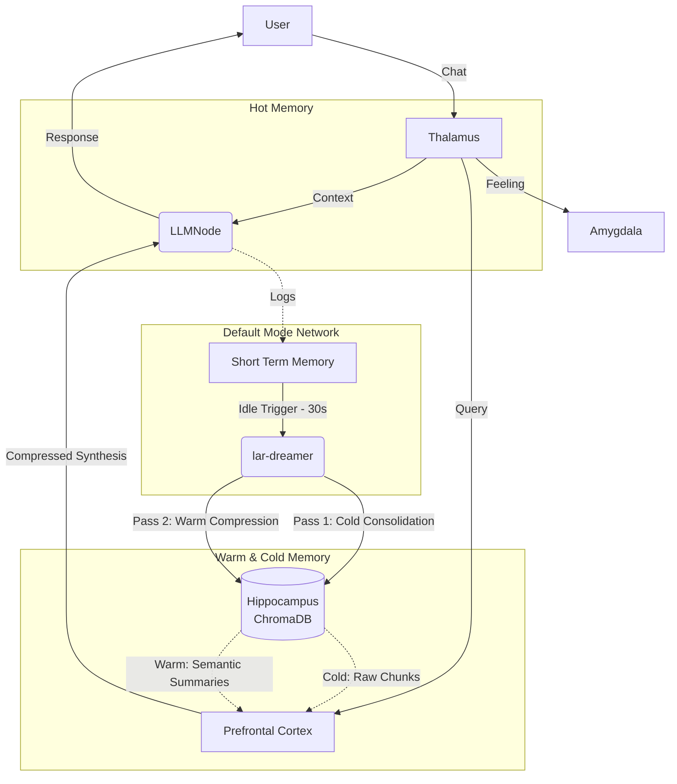

<p align="center">
  
</p>
<p align="center"><em>Lár: The DMN Project</em></p>
<p align="center">
  <a href="https://github.com/snath-ai/lar">
    
  </a>
  <a href="https://github.com/snath-ai/DMN">
    
  </a>
  <a href="https://doi.org/10.5281/zenodo.18175178">
    
  </a>
</p>

# Lár DMN: Bicameral Memory Architecture (v2.0)

This repository serves as a reference implementation for **Autopoietic AI**: agents that are continuous, self-organizing, and biologically inspired. It implements the **Default Mode Network (DMN)**, a background cognitive system active during rest, to solve the problem of catastrophic forgetting and static personality in standard LLM agents.

## Core Philosophy

Standard "Glass Box" agents are tools: they wait for input, execute, and return to a null state.
**Lár DMN is an organism.** It runs 24/7. When the user is away, it "sleeps"—activating a background daemon that dreams about recent interactions to consolidate them into long-term vector memory.

---

## Neuro-Architecture

The system is split into two distinct processes (Bicameralism), bridging the Fast (Conscious) and Slow (Subconscious) hemispheres.


```mermaid
graph TD
    User -->|Chat| Thalamus
    Thalamus -->|Feeling| Amygdala
    
    %% Memory Tiers
    subgraph Working Memory [Hot Memory]
        Thalamus -->|Context| Cortex(LLMNode)
    end
    
    subgraph Deep Memory [Warm & Cold Memory]
        Thalamus -->|Query| PFC[Prefrontal Cortex]
        Hippo[(Hippocampus<br>ChromaDB)] -.->|Cold: Raw Chunks| PFC
        Hippo -.->|Warm: Semantic Summaries| PFC
        PFC -->|Compressed Synthesis| Cortex
    end
    
    Cortex -->|Response| User
    
    subgraph DMN [Default Mode Network]
        Cortex -.->|Logs| STM[Short Term Memory]
        STM -->|Idle Trigger - 30s| Dreamer(lar-dreamer)
        Dreamer -->|Pass 1: Cold Consolidation| Hippo
        Dreamer -->|Pass 2: Warm Compression| Hippo
    end
```

### 1. The Thalamus (The Gateway)
**Type**: Input Router / Prompt Engineer
**Function**:
The Thalamus is the first point of contact. It does not simply pass user text to the LLM. Instead, it constructs a **Dynamic System Prompt** for each turn based on three factors:
1.  **Sensory Input**: The user's message.
2.  **Emotional State**: It queries the `Amygdala` to inject an emotional context (e.g., "The user is aggressive, you feel defensive").
3.  **Memory**: It queries the `Hippocampus` for relevant past dreams.

*Crucially, the Thalamus implements the "Wake Up Protocol". If the agent has been sleeping, the Thalamus injects the "Last Dream" into the context, causing the agent to wake up groggy or inspired by its background thoughts.*

### 2. The Amygdala (Emotional Processor)
**Type**: State Machine
**Function**:
Simulates a rudimentary emotional state (Valence and Arousal).
-   **Input**: Analyzes user sentiment.
-   **State**: Maintains a persistent mood (e.g., Neutral, Happy, Anxious).
-   **Output**: Modifies the system prompt to color the agent's tone. This prevents the "flat affect" typical of AI assistants.

### 3. The Default Mode Network (Subconscious Daemon)
**Type**: Background Worker (`lar-dreamer`)
**Function**:
This is a separate process that monitors the Short Term Memory (logs).
-   **Sleep Trigger**: If no user interaction occurs for `N` seconds, the DMN activates.
-   **Dreaming**: It reads the recent raw logs and prompts a "Smart" Model (e.g., Qwen 2.5) to synthesize them into a higher-level narrative.
-   **Consolidation**: The generated "Dream" is sent to the Hippocampus for permanent storage.

### 4. The Hippocampus (Memory Center)
**Type**: Hybrid Vector Database
**Function**:
Implements a "Dual-Write" strategy for robustness:
1.  **narrative_store** (`dreams.json`): A human-readable chronological log of every insight the agent has ever had.
2.  **vector_store** (`ChromaDB`): A semantic index of those insights.
### 5. The Prefrontal Cortex (Memory Compression)
**Type**: Synthesis Layer (`PrefrontalNode`)
**Function**:
Solves KV cache bloat. Instead of injecting raw vector chunks from the Hippocampus into the prompt (which consumes thousands of tokens), the PFC intercepts the retrieval. It synthesizes top Cold and Warm memories into a dense, <100 word summary, passing only the *meaning* to the Cortex.

---

## The 3-Tier Memory Architecture (DMN v2)

1. **Tier 1 (Hot Memory)**: A rolling buffer of the last 5 interactions. Stored in memory, injected verbatim for immediate conversational flow.
2. **Tier 2 (Warm Memory)**: Compressed semantic summaries generated by the DMN during "sleep". Stored in a ChromaDB collection (`warm_memory`) and capped at 500 entries.
3. **Tier 3 (Cold Memory)**: Massive, raw chronological chunks and narrative dreams in ChromaDB (`long_term_memory`). Retrieved but **never** injected directly; they must pass through the PFC compression layer.

---

## Solving Catastrophic Forgetting

Standard LLM agents suffer from **agent-level catastrophic forgetting**: once the context window fills up, old messages are silently truncated and the agent permanently loses all knowledge of past interactions. Talk to any chatbot for two hours, and it forgets the first hour.

The DMN solves this **architecturally**, without retraining or modifying model weights:

1.  **Consolidation, not Accumulation.** The Dreamer synthesizes raw interaction logs into dense semantic narratives during idle periods. Meaning is preserved; raw tokens are discarded.
2.  **Tiered Retrieval.** Hot Memory provides immediate conversational flow. Warm and Cold Memory provide deep, long-term recall — routed through the Prefrontal Cortex so only compressed, relevant context enters the prompt.
3.  **Infinite Horizon.** Because memories are permanently stored in ChromaDB and retrieved on demand, the agent can run indefinitely without ever hitting a context window limit.

### The Human Analogy

This is not a novel strategy — it is how biological brains actually work.

Human brains do not rewrite their neural weights every night. Instead, the **Hippocampus** consolidates the day's experiences into long-term cortical storage during sleep. You don't remember every pixel of your morning commute; you remember that it rained and traffic was bad. The raw sensory data is gone, but the *meaning* persists.

The DMN implements this exact biological strategy as software architecture:

| Human Brain | Lár DMN |
|---|---|
| Sensory Input | User Messages (Raw Logs) |
| Hippocampal Consolidation (Sleep) | Dreamer Daemon (Idle Trigger) |
| Long-Term Cortical Storage | ChromaDB (Warm + Cold Tiers) |
| Prefrontal Filtering (Attention) | PrefrontalNode (Compression Gateway) |
| Working Memory | Hot Memory (Last 5 Turns) |

> **Key Insight:** Researchers have spent billions trying to solve catastrophic forgetting at the model weight level through continual learning. The DMN takes a different approach: *don't fix the brain — build an external Hippocampus.* The base LLM remains frozen. Memory is an architectural concern, not a training concern.

---

## Technical Features (v1.0.0)

### Model Switcher
Different cognitive tasks require different models. Lár DMN supports dynamic model switching via the UI:
-   **Conscious Mind (Fast)**: Use a low-latency model (e.g., `llama3.2`) for the chat loop to ensure responsiveness.
-   **Subconscious Mind (Smart)**: Use a high-reasoning model (e.g., `qwen2.5:14b` or `gpt-4o`) for the Dreaming process, where latency doesn't matter but insight quality does.

### Docker Architecture
The system is fully containerized:
-   `lar-awake`: The Streamlit UI and Thalamus (Conscious).
-   `lar-dreamer`: The Python Daemon and DMN (Subconscious).
-   Shared Volume (`/data`): Bridging the two minds.

---

## Installation & Usage

### Prerequisites
1.  **Docker Desktop** installed.
2.  **Ollama** running locally (or API keys for Cloud models).

### Quick Start
```bash
# 1. Clone
git clone https://github.com/snath-ai/DMN
cd DMN/lar

# 2. Build and Run (Background)
docker-compose up --build -d

# 3. Open the Interface
# Navigate to http://localhost:8501
```

### Detailed Usage Instructions
1.  **Wake Phase (Active Chat)**: Open the web UI and begin naturally chatting with the agent. Watch the UI indicators verify Amygdala sentiment scoring. Because of the DMN v2 architecture, you can chat for hours without experiencing KV cache bloat. You will see a countdown timer in the sidebar tracking your idle time.
2.  **Sleep Phase (Background Consolidation)**: Stop chatting. After 30 seconds of idle time, the Streamlit UI will display `💤 Brain Sleeping / Dreaming`. In the background, the `lar-dreamer` container wakes up. 
3.  **Dream Phase (DMN dual-pass)**: The Dreamer reads the recent chat logs. It performs Pass 1 (saving raw vectors as Cold Memory) and Pass 2 (synthesizing the interaction into a dense paragraph as Warm Memory). Check `docker logs -f lar-dreamer` to watch this happen live.
4.  **Recall Phase (Prefrontal Compression)**: Talk to the agent again and ask it about a past topic. The `Hippocampus` retrieves matching Warm and Cold vectors, but sends them through the `PrefrontalNode`. The PFC aggressively compresses thousands of fetched tokens into a single 100-word paragraph before injecting it into the prompt.
5.  **Model Switching**: Expand the **Neural Configuration** sidebar panel. You can swap the "Conscious Mind" (the fast chat model) and the "Subconscious Mind" (the heavy dreaming model) on the fly. Vector embeddings remain strictly tied to `llama3.2` to prevent memory corruption. 
6.  **Wipe Brain**: If you want to start fresh, click the `🧹 Wipe Brain (Delete Memory)` button in the sidebar. This aggressively clears all json logs and deletes the ChromaDB vector collections, rebooting the agent with a clean slate.

---

## License
**Apache 2.0**.

**Note**: This repository is a **Showcase of Cognitive Architectures** built upon the [Lár Engine](https://github.com/snath-ai/lar). It is intended to demonstrate advanced concepts in Autopoietic AI, Bicameral Memory, and Neuro-Mimetic design.
