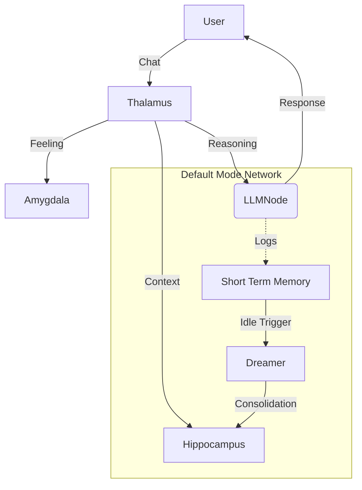

<p align="center">
  
</p>
<p align="center"><em>Lár: The DMN Project</em></p>
<p align="center">
  <a href="https://github.com/snath-ai/lar">
    
  </a>
  <a href="https://github.com/snath-ai/DMN">
    
  </a>
  <a href="https://doi.org/10.5281/zenodo.18175178">
    
  </a>
</p>

# Lár DMN: Bicameral Memory Architecture (v1.0.0)

This repository serves as a reference implementation for **Autopoietic AI**: agents that are continuous, self-organizing, and biologically inspired. It implements the **Default Mode Network (DMN)**, a background cognitive system active during rest, to solve the problem of catastrophic forgetting and static personality in standard LLM agents.

## Core Philosophy

Standard "Glass Box" agents are tools: they wait for input, execute, and return to a null state.
**Lár DMN is an organism.** It runs 24/7. When the user is away, it "sleeps"—activating a background daemon that dreams about recent interactions to consolidate them into long-term vector memory.

---

## Neuro-Architecture

The system is split into two distinct processes (Bicameralism), bridging the Fast (Conscious) and Slow (Subconscious) hemispheres.



### 1. The Thalamus (The Gateway)
**Type**: Input Router / Prompt Engineer
**Function**:
The Thalamus is the first point of contact. It does not simply pass user text to the LLM. Instead, it constructs a **Dynamic System Prompt** for each turn based on three factors:
1.  **Sensory Input**: The user's message.
2.  **Emotional State**: It queries the `Amygdala` to inject an emotional context (e.g., "The user is aggressive, you feel defensive").
3.  **Memory**: It queries the `Hippocampus` for relevant past dreams.

*Crucially, the Thalamus implements the "Wake Up Protocol". If the agent has been sleeping, the Thalamus injects the "Last Dream" into the context, causing the agent to wake up groggy or inspired by its background thoughts.*

### 2. The Amygdala (Emotional Processor)
**Type**: State Machine
**Function**:
Simulates a rudimentary emotional state (Valence and Arousal).
-   **Input**: Analyzes user sentiment.
-   **State**: Maintains a persistent mood (e.g., Neutral, Happy, Anxious).
-   **Output**: Modifies the system prompt to color the agent's tone. This prevents the "flat affect" typical of AI assistants.

### 3. The Default Mode Network (Subconscious Daemon)
**Type**: Background Worker (`lar-dreamer`)
**Function**:
This is a separate process that monitors the Short Term Memory (logs).
-   **Sleep Trigger**: If no user interaction occurs for `N` seconds, the DMN activates.
-   **Dreaming**: It reads the recent raw logs and prompts a "Smart" Model (e.g., Qwen 2.5) to synthesize them into a higher-level narrative.
-   **Consolidation**: The generated "Dream" is sent to the Hippocampus for permanent storage.

### 4. The Hippocampus (Memory Center)
**Type**: Hybrid Vector Database
**Function**:
Implements a "Dual-Write" strategy for robustness:
1.  **narrative_store** (`dreams.json`): A human-readable chronological log of every insight the agent has ever had.
2.  **vector_store** (`ChromaDB`): A semantic index of those insights.
*Why?* Standard RAG retrieves raw chunks. Lár retrieves *synthesized dreams*, allowing it to recall the *meaning* of a past conversation, not just the keywords.

---

## Technical Features (v1.0.0)

### Model Switcher
Different cognitive tasks require different models. Lár DMN supports dynamic model switching via the UI:
-   **Conscious Mind (Fast)**: Use a low-latency model (e.g., `llama3.2`) for the chat loop to ensure responsiveness.
-   **Subconscious Mind (Smart)**: Use a high-reasoning model (e.g., `qwen2.5:14b` or `gpt-4o`) for the Dreaming process, where latency doesn't matter but insight quality does.

### Docker Architecture
The system is fully containerized:
-   `lar-awake`: The Streamlit UI and Thalamus (Conscious).
-   `lar-dreamer`: The Python Daemon and DMN (Subconscious).
-   Shared Volume (`/data`): Bridging the two minds.

---

## Installation & Usage

### Prerequisites
1.  **Docker Desktop** installed.
2.  **Ollama** running locally (or API keys for Cloud models).

### Quick Start
```bash
# 1. Clone
git clone https://github.com/snath-ai/DMN
cd DMN/lar

# 2. Build and Run (Background)
docker-compose up --build -d

# 3. Open the Interface
# Navigate to http://localhost:8501
```

### The Life Cycle
1.  **Wake Phase**: Chat with the agent. Watch it respond to your tone (`Amygdala`).
2.  **Sleep Phase**: Stop chatting. After 30s (default), the `lar-dreamer` service wakes up. Check `docker logs -f lar-dreamer`.
3.  **Dream Phase**: The DMN reads your chat, summarizes it, and saves it to ChromaDB.
4.  **Recall Phase**: Chat again about a related topic. The `Hippocampus` will inject the previous dream, and the agent will "remember" the concept.

---

## License
**Apache 2.0**.

**Note**: This repository is a **Showcase of Cognitive Architectures** built upon the [Lár Engine](https://github.com/snath-ai/lar). It is intended to demonstrate advanced concepts in Autopoietic AI, Bicameral Memory, and Neuro-Mimetic design.
