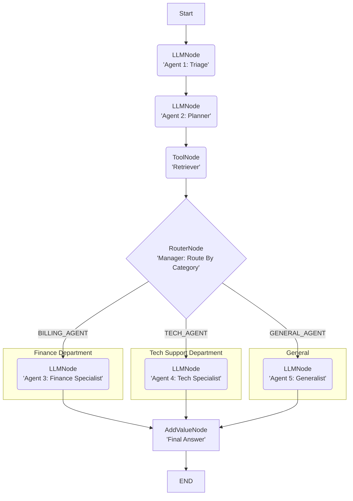

# Guide: Multi-Agent Orchestration

**The real power of lar is building "multi-agent" systems.**

Other frameworks use a "chaotic chat room" model, where agents talk to each other and you hope for a good result. `lar` is a deterministic "assembly line." You are the architect. You build a "glass box" graph that routes a task to specialized agents, guaranteeing order and auditing every step.

**This guide builds a "Customer Support Bot" that routes tasks to different "specialist" agents.**

### The "Glass Box" Flowchart



## The Code (The "Lego Bricks" in Action)

This is all you need to build and run this agent. It's just clean, explicit Python.

```python
from lar import *
from lar.utils import compute_state_diff # (Used by executor)

# 1. Define the "choice" logic for our Router
def triage_router_function(state: GraphState) -> str:
    """Reads the 'category' from the state and returns a route key."""
    category = state.get("category", "GENERAL").strip().upper()
    
    if "BILLING" in category:
        return "BILLING_AGENT"
    elif "TECH_SUPPORT" in category:
        return "TECH_AGENT"
    else:
        return "GENERAL_AGENT"

# 2. Define the agent's nodes (the "bricks")
# We build from the end to the start.

# --- The End Nodes (the destinations) ---
final_node = AddValueNode(key="final_response", value="{agent_answer}", next_node=None)
critical_fail_node = AddValueNode(key="final_status", value="CRITICAL_FAILURE", next_node=None)

# --- The "Specialist" Agents ---
billing_agent = LLMNode(
    model_name="gemini/gemini-2.5-pro",
    prompt_template="You are a BILLING expert. Answer '{task}' using ONLY this context: {retrieved_context}",
    output_key="agent_answer",
    next_node=final_node
)
tech_agent = LLMNode(
    model_name="gemini/gemini-2.5-pro",
    prompt_template="You are a TECH SUPPORT expert. Answer '{task}' using ONLY this context: {retrieved_context}",
    output_key="agent_answer",
    next_node=final_node
)
general_agent = LLMNode(
    model_name="gemini/gemini-2.5-pro",
    prompt_template="You are a GENERAL assistant. Answer '{task}' using ONLY this context: {retrieved_context}",
    output_key="agent_answer",
    next_node=final_node
)
    
# --- The "Manager" (Router) ---
specialist_router = RouterNode(
    decision_function=triage_router_function,
    path_map={
        "BILLING_AGENT": billing_agent,
        "TECH_AGENT": tech_agent,
        "GENERAL_AGENT": general_agent
    },
    default_node=general_agent
)
    
# --- The "Retriever" (Tool) ---
# (Assumes you have a 'retrieve_relevant_chunks' tool defined)
retrieve_node = ToolNode(
    tool_function=retrieve_relevant_chunks, 
    input_keys=["search_query"],
    output_key="retrieved_context",
    next_node=specialist_router, 
    error_node=critical_fail_node
)
    
# --- The "Planner" (LLM) ---
planner_node = LLMNode(
    model_name="gemini/gemini-2.5-pro",
    prompt_template="You are a search query machine. Convert this task to a search query: {task}. Respond with ONLY the query.",
    output_key="search_query",
    next_node=retrieve_node
)
    
# --- The "Triage" Node (The *real* start) ---
triage_node = LLMNode(
    model_name="gemini/gemini-2.5-pro",
    prompt_template="You are a triage bot. Classify this task: \"{task}\". Respond ONLY with: BILLING, TECH_SUPPORT, or GENERAL.",
    output_key="category",
    next_node=planner_node
)

# 3. Run the Agent
 executor = GraphExecutor()
initial_state = {"task": "How do I reset my password?"}
result_log = list(executor.run_step_by_step(
    start_node=triage_node, 
    initial_state=initial_state
))
```