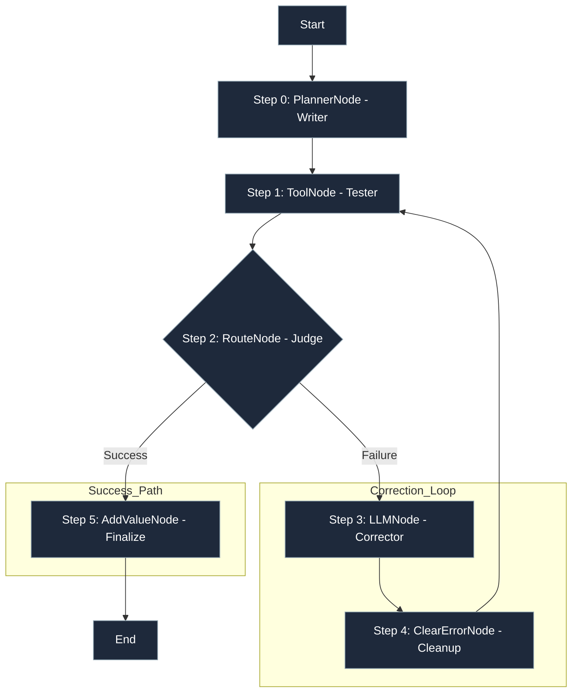

# Guide: Self-Correcting Loops

**This is the most powerful pattern in lar. You can build an agent that tests its own work and loops until it meets your quality standard.**
**This `"Code-Fixer"` agent will:**

- Write a piece of code.

- Test that code with a ToolNode.

- Judge the result with a RouterNode.

- If the test fails, it loops back to a "Corrector" LLMNode with the exact error message and tries again.


### The "Glass Box" Flowchart

**This is the "assembly line" for a self-correcting agent.**



### The Code (The "Lego Bricks" in Action)
```python
from lar import *
from lar.utils import compute_state_diff

# 1. Define the "tool" (our test) and "logic"
def run_generated_code(code_string: str) -> str:
    """A 'tool' that executes LLM-generated code and runs a test."""
    try:
        local_scope = {}
        exec(code_string, {}, local_scope)
        func = local_scope['add_five']
        result = func(10)
        if result != 15:
            raise ValueError(f"Logic error: Expected 15, but got {result}")
        return "Success!"
    except Exception as e:
        raise e # Fail loudly

def judge_function(state: GraphState) -> str:
    """The 'choice' logic for our Router."""
    if state.get("last_error"):
        return "failure"
    else:
        return "success"

# 2. Define the agent's nodes (the "bricks")
success_node = AddValueNode(key="final_status", value="SUCCESS", next_node=None)
critical_fail_node = AddValueNode(key="final_status", value="CRITICAL_FAILURE", next_node=None)

# --- The "Correction Loop" ---
tester_node = ToolNode(
    tool_function=run_generated_code,
    input_keys=["code_string"],
    output_key="test_result",
    next_node=None, # Will be set to the Judge
    error_node=None # Will be set to the Judge
)

clear_error_node = ClearErrorNode(
    next_node=tester_node # After clearing, loop back to the Tester
)

corrector_node = LLMNode(
    model_name="gemini/gemini-2.5-pro",
    prompt_template="Your last attempt failed. Fix this code: {code_string}. Error: {last_error}",
    output_key="code_string",
    next_node=clear_error_node
)

# --- The "Judge" (Router) ---
judge_node = RouterNode(
    decision_function=judge_function,
    path_map={
        "success": success_node,
        "failure": corrector_node # On failure, go to the Corrector
    },
    default_node=critical_fail_node
)

# --- Link the Tester node to the Judge ---
tester_node.next_node = judge_node
tester_node.error_node = judge_node

# --- The "Start" Node (The Planner/Writer) ---
planner_node = LLMNode(
    model_name="gemini/gemini-2.5-pro",
    prompt_template="Write a Python function `add_five(x)` that returns x + 5.",
    output_key="code_string",
    next_node=tester_node # After writing, go to the Tester
)

# 3. Run the Agent
executor = GraphExecutor()
initial_state = {"task": "Write a function to add 5"}
result_log = list(executor.run_step_by_step(
    start_node=planner_node, 
    initial_state=initial_state
))
```